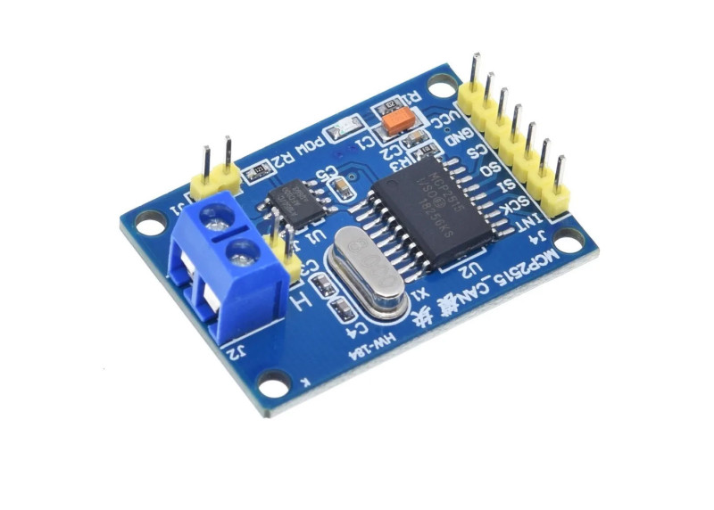
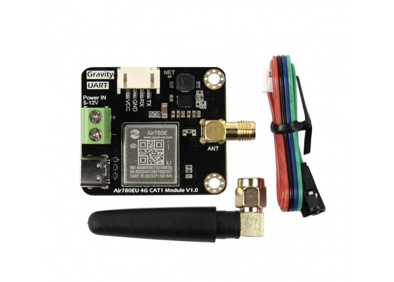
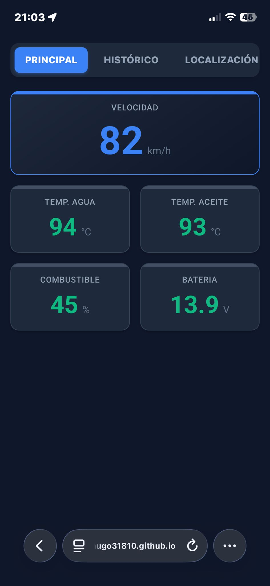
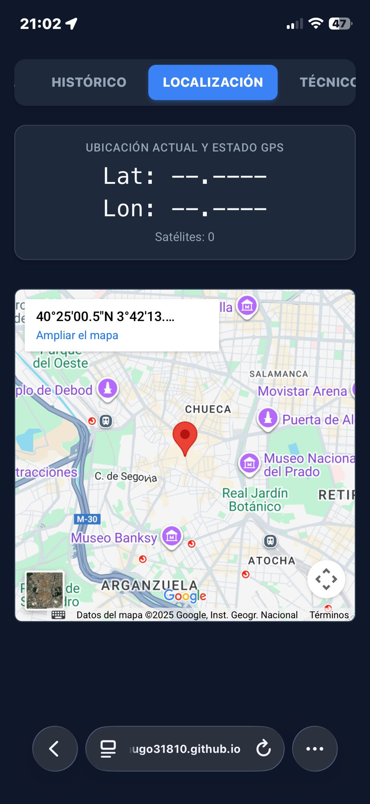
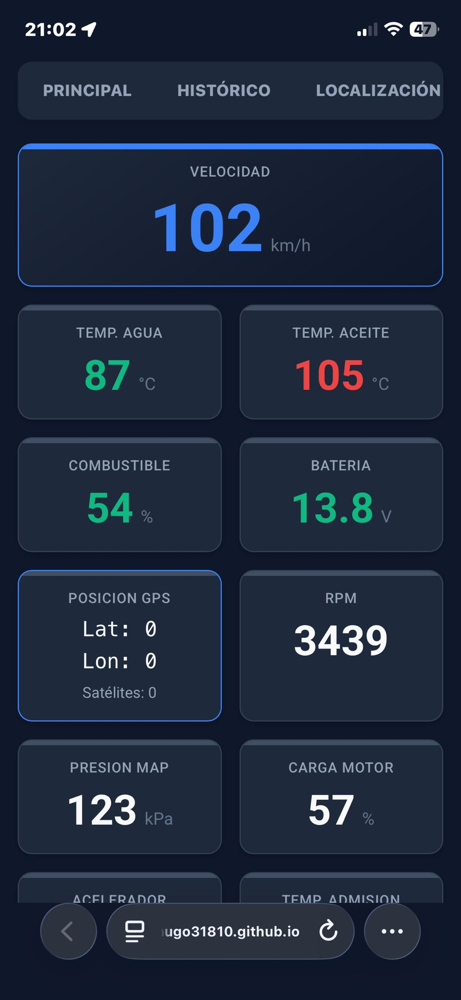
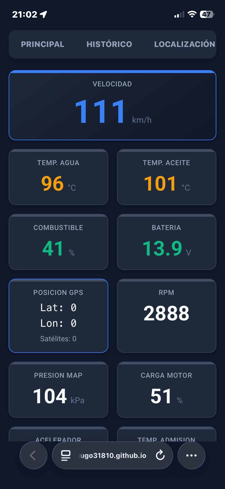
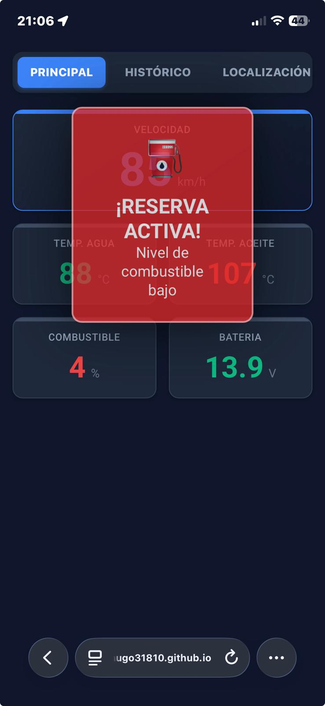
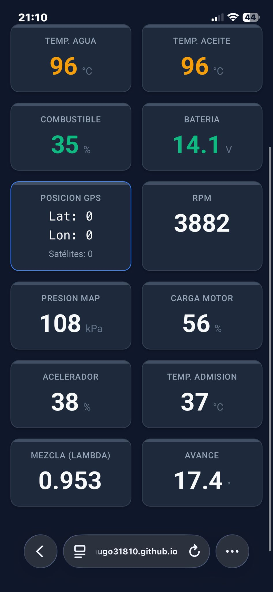

# IoT Vehicle Telemetry and Remote Monitoring System

Este repositorio presenta el diseño e implementación de un **sistema IoT completo para telemetría vehicular**, orientado a la **monitorización remota, diagnóstico preventivo y gestión de alertas en tiempo real**.

El proyecto integra **hardware embebido, buses industriales (CAN), redes celulares (4G/LTE) y una interfaz web en tiempo real**, siguiendo una arquitectura escalable basada en **MQTT** y principios de **Inteligencia Ambiental**.

---

## 1. Motivación y Objetivos

Este proyecto surge de la necesidad de **monitorizar en tiempo real los parámetros críticos de un vehículo**, permitiendo un diagnóstico preventivo y una gestión inmediata de alertas. Asimismo, permite **modernizar vehículos antiguos** que no disponen de sistemas avanzados para la visualización y análisis de todos los parámetros internos del vehículo.

### Objetivos principales

El objetivo es implementar una solución completa que cubra las **cuatro capas de la arquitectura de Inteligencia Ambiental**:

1. **Capa de Percepción:**  
   Adquisición de datos del bus de campo del vehículo (CAN/OBD-II) y posicionamiento global (GNSS).

2. **Capa de Transporte:**  
   Transmisión de datos a través de redes de área amplia (WAN) utilizando tecnología **4G/LTE**.

3. **Capa de Procesamiento:**  
   Gestión y distribución de mensajes mediante un **broker MQTT**.

4. **Capa de Aplicación:**  
   Visualización en una interfaz web con lógica de **sensibilidad al contexto**.

---

## 2. Arquitectura de Hardware (Capa de Percepción)

El núcleo del sistema es una **Raspberry Pi**, que actúa como *gateway* IoT. La arquitectura de hardware se ha diseñado para ser robusta frente a las condiciones eléctricas propias de un vehículo.

### 2.1 Interfaz CAN Bus SPI (Módulo integrado)

A diferencia de los adaptadores OBD-II comerciales USB (basados en ELM327), que suelen ser lentos, se ha optado por una **integración a bajo nivel** mediante un **módulo CAN Bus SPI integrado**.

Este módulo combina en una sola PCB:

- **Transceptor TJA1050:**  
  Adapta los niveles eléctricos entre la lógica digital y el par diferencial del bus CAN (`CAN_H`, `CAN_L`).

- **Controlador MCP2515:**  
  Gestiona el protocolo CAN 2.0B, el filtrado de tramas y los buffers, comunicándose con la Raspberry Pi mediante **SPI**.



El módulo se conecta al puerto OBD-II del vehículo a través de los pines correspondientes al bus CAN (pin 6 y 14):


---

### 2.2 Conectividad y energía

- **Módulo 4G (Air780EU):**  
  Conectado mediante **USB** en lugar de GPIO/UART para garantizar mayor ancho de banda y una gestión eficiente mediante `ModemManager`.



- **Convertidor DC-DC:**  
  Conversión de 12V a 5V (3A) con **protección contra inversión de polaridad**, aislando la Raspberry Pi de picos de tensión del sistema eléctrico del vehículo.


---

## 3. Arquitectura de Software y Protocolos

La arquitectura software sigue un patrón **Publicación/Suscripción**, fundamental para sistemas distribuidos con conectividad intermitente.

### 3.1 Tecnologías clave

| Tecnología | Rol | Justificación |
|----------|-----|---------------|
| **MQTT** | Transporte | Cabecera ligera y eficiencia en redes móviles (4G/LTE). |
| **Python** | Backend | Integración sencilla con hardware y serialización JSON. |
| **HTML5 / JS** | Frontend | Acceso multiplataforma sin necesidad de apps nativas. |

---

### 3.2 Justificación del broker: EMQX Cloud vs. Mosquitto

Se optó por un **broker MQTT en la nube (`broker.emqx.io`)** frente a una instalación local de Mosquitto por dos razones críticas:

1. **Superación del CGNAT:**  
   Las redes 4G utilizan IPs privadas, impidiendo conexiones entrantes. El broker en la nube permite que tanto el vehículo como el cliente web inicien conexiones salientes.

2. **Soporte WebSockets Seguros (WSS):**  
   Los navegadores requieren WSS para conexiones MQTT desde HTTPS. EMQX ofrece soporte nativo, permitiendo la integración directa con **GitHub Pages**.

---

### 3.3 Estructura de datos y serialización

La comunicación se realiza mediante **JSON**, compatible de forma nativa con Python y JavaScript.

El script de telemetría actúa como un **agregador de datos**, fusionando:

1. **Datos del motor (CAN):** RPM, velocidad, temperatura, combustible.
2. **Datos de ubicación (GPS):** Latitud y longitud.
3. **Metadatos:** Marca temporal.

**Ejemplo de mensaje JSON:**

```json
{
  "rpm": 2150,
  "speed": 88,
  "temp": 92,
  "fuel": 45.5,
  "battery": 13.4,
  "lat": 40.416775,
  "lon": -3.703790,
  "timestamp": "2024-12-15T18:30:00"
}
````

---

## 4. Desarrollo e Implementación

### 4.1 Backend: Decodificación de bajo nivel (OBD-II / CAN)

El sistema interpreta directamente tramas CAN, aplicando las fórmulas del estándar **SAE J1979**, lo que permite un control total sobre la decodificación y un rendimiento óptimo.

```python
def parse_pid_data(pid, data):
    if not data:
        return None

    if pid == 0x0C:   # RPM
        return int(((data[3] * 256) + data[4]) / 4)
    elif pid == 0x0D: # Velocidad
        return int(data[3])
    elif pid == 0x05: # Temperatura
        return int(data[3] - 40)
    elif pid == 0x2F: # Combustible
        return round((data[3] * 100) / 255, 1)

    return None
```

---

### 4.2 Despliegue en nube y WebSockets

La interfaz web se despliega mediante **GitHub Pages**, sirviendo un único fichero `index.html` bajo HTTPS.

* **Eficiencia:** Mínimas peticiones HTTP.
* **Seguridad:** HTTPS obligatorio para WSS.

```javascript
const client = new Paho.MQTT.Client("broker.emqx.io", 8084, "/mqtt", clientID);

client.onMessageArrived = (msg) => {
    const data = JSON.parse(msg.payloadString);
    updateDataAndState(data);
};

client.connect({
    useSSL: true,
    onSuccess: () => {
        client.subscribe("coches/raspi1/telemetria");
    }
});
```

---

### 4.3 Guardado de datos y modo simulación

* **Persistencia local:**
  Guardado de todos los datos en `.csv` para análisis offline.

* **Modo simulación:**
  Permite validar la interfaz y las alertas sin conexión real al vehículo.

---

## 5. Sensibilidad al Contexto (Lógica de Aplicación)

El sistema implementa **Inteligencia Ambiental** mediante un sistema de alertas tipo semáforo:

| Métrica     | Verde      | Naranja     | Rojo   | Acción       |
| ----------- | ---------- | ----------- | ------ | ------------ |
| Temperatura | 75–95°C    | <75 / >95   | ≥105°C | Cambio CSS   |
| Batería     | 12.5–14.8V | 12.0 / 15.0 | <11.5V | Cambio CSS   |
| Combustible | >20%       | 10–20%      | ≤10%   | Notificación |

---

## 6. Interfaz de Usuario

* **URL:** [https://hugo31810.github.io/IoT_OBD_reader/](https://hugo31810.github.io/IoT_OBD_reader/)
* **Estado:** Operativa (sin datos en tiempo real)

### Capturas

**Dashboard principal**


**Vista de localización**


**Alertas en móvil**

|  |  |  |

**Parámetros avanzados y gráficos**

|  |  |

---

## 7. Costes y Escalabilidad

**Coste total aproximado:** ~76€

La arquitectura permite escalar de un solo vehículo a **gestión de flotas**, habilitando casos de uso como:

* Carsharing
* Logística y reparto
* Mantenimiento predictivo
* Auditoría de conducción

---

## 8. Conclusiones

El proyecto demuestra la integración efectiva de **hardware embebido, redes celulares, protocolos IoT y desarrollo web** en un sistema funcional y escalable. La solución resultante permite una monitorización vehicular realista, segura y preparada para entornos productivos.

---

## 9. Tech Stack

* **Hardware:** Raspberry Pi, MCP2515, TJA1050, GPS NEO-6M, Air780EU
* **Protocols:** CAN, OBD-II (SAE J1979), MQTT, WebSockets
* **Backend:** Python
* **Frontend:** HTML5, CSS, JavaScript
* **Cloud:** EMQX Cloud, GitHub Pages

---

## 10. Bibliografía

## SAE J1979, MQTT 3.1.1, Eclipse Paho, CSS Electronics, DFRobot, Wikipedia OBD-II PID.

**Autor:** Hugo Salvador Aizpún
Proyecto desarrollado en el marco de la asignatura **Inteligencia Ambientaal y Computación Ubicua**  
Universidad Rey Juan Carlos – Curso 2025–2026
